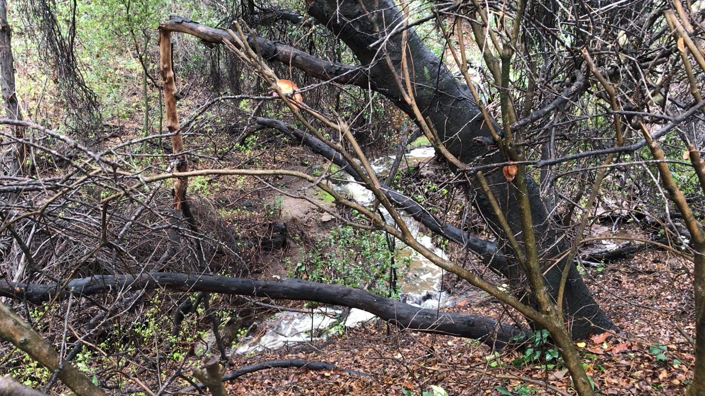
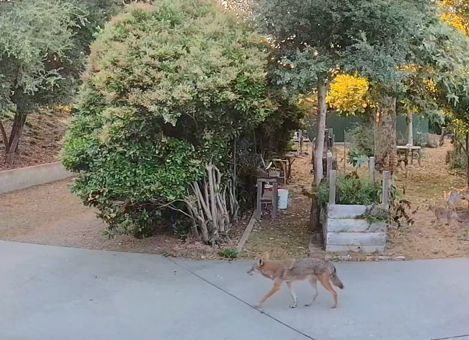
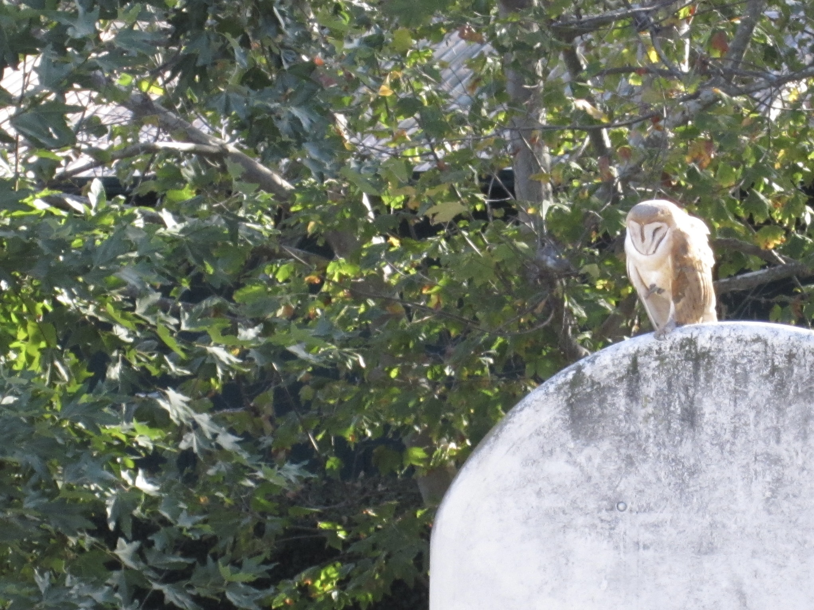

# Urban Wildlife

Yin Yang Ranch is a suburban 2 acre lot that is a mile from a 6 lane freeway and surrounded by typical suburban neighborhoods with several lots per acre and lots 
of walls and fences. There is a creek (or ditch? or Barranca? Let's call it a 
creek) that runs under a 4 lane road and along 2 sides of our lot. A variety of
wildlife uses the creek as a way to move from the hills above us to the various 
creeks and drainage basins below us. 

## Lots of Critters live here and roam through

In our 25 years here, we have seen an abundance of wildlife. As new neighborhoods 
have developed around us, the wildlife have increasingly used our property as a
refuge and way-station. We have actually seen more wildlife activity in recent
times than in years past, possibly because many of the open lots and empty fields 
are being built up. 

We regularly see coyotes, bobcats, raccoons and possums pass through. A coyote
pack with 3 adults and 5 pups is living here this year and we see them almost
every day. 

We have a wide variety of birds, including red tail hawks, ravens, crows, quail
and hummingbirds. We have honeybees as well as many species of native bees that
nest in the ground or in holes in trees. We are a way station for Monarch Butterflies 
and plant native milkweed to feed their caterpillars.

## Observing Critters with Cameras and Software

We have many cameras around the farm to watch the wildlife and learn about what 
lives here and passes through. We use a mix of commercial cameras (Google Nest 
Cameras with integrated infrared lights) and home-built cameras (Raspberry Pi
computers with various cameras attached). We are developing software to watch
the cameras and identify species (coyote or bobcat?) as well as specific
individual animals (for example, coyote 2024-C3, seen 3 times in the last 3 days). 
More information about the hardware and software we are developing is on our 
[GitHub project page for Yin Yang Ranch](https://github.com/jeffbass/yin-yang-ranch).

## Some Videos and Photos of Yin Yang Ranch

- [Photos of Yin Yang Ranch](https://www.flickr.com/people/195006677@N08/) (link goes to Yin Yang Ranch photos on Flickr)
- [Yin Yang Ranch YouTube Channel](https://youtube.com/@yinyangranch-h1p?si=PQykr61daCJ45kae) (link goes to YouTube) 

