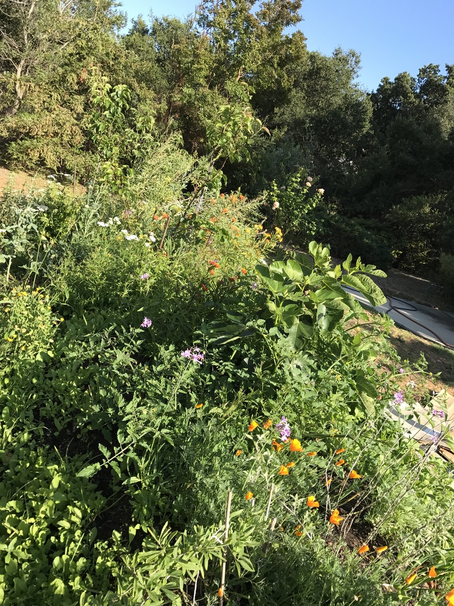
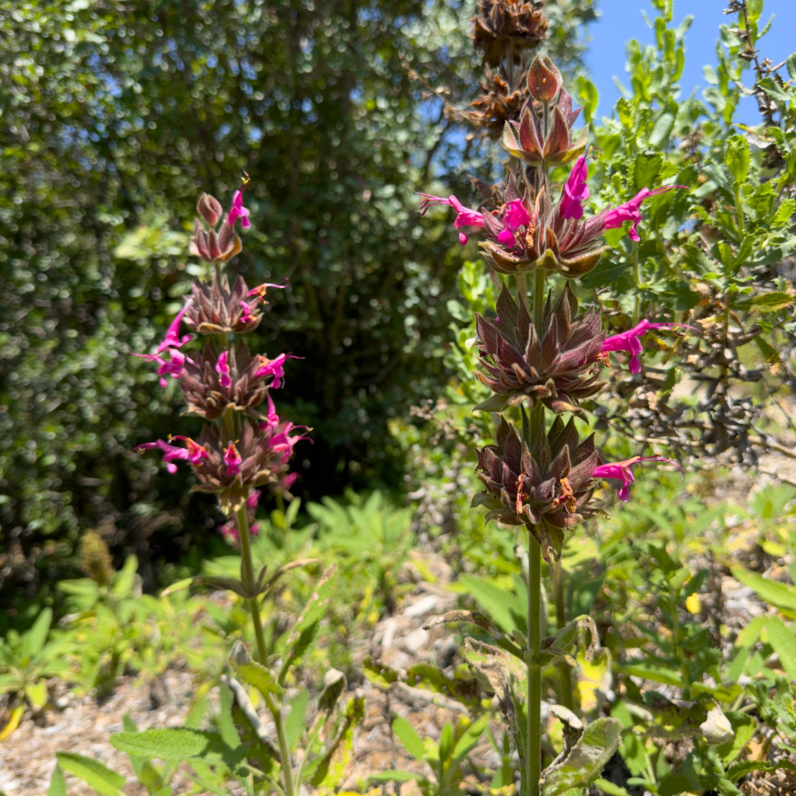
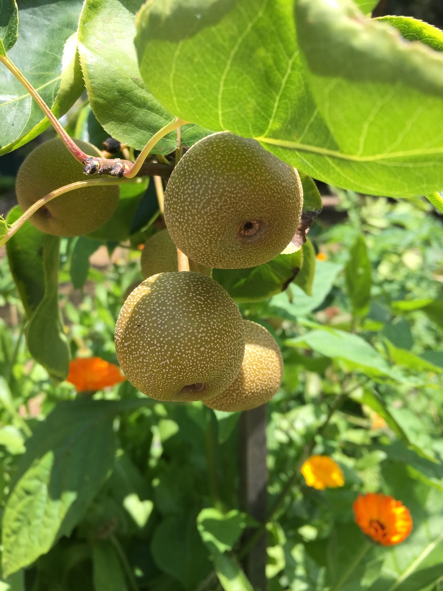

# Native Plants. Not Lawns
Yin Yang Ranch was a typical suburban 2 acre lot when we bought it about 30 years
ago. We tore up the lawn and replaced it with Hugels and raised garden beds. We 
started out trying to grow a typical vegetable garden with tomatoes and squash
and ...

## Letting Wildlife Win
The critters got almost all of our vegetables. And we realized that growing
vegetables with chlorinated tap water was not as effective as buying vegetables
from our local organic farmers who are using well water. So we decided to plant
various native plants that make the best use of our limited rainwater and
support the local wildlife.

We still have some grapes and fruit trees. The birds and squirrels get most of 
the fruit...but we still get enough. We grow plants like chives and mint that the 
wildlife leaves alone. We are still figuring out what works and what doesn't.

## Native Plants Belong Here
The vast majority of plants on our farm are natives. Mostly native Coast Live 
Oaks. We have planted dozens of these along the edges of the property and along
the driveways. We have also planted many other local natives:

- Hummingbird Sage
- Laurel Sumac
- California Poppies 
- White Yarrow
- Native Milkweeds (for the Monarch Butterflies)
- Mexican Elderberry 
- Toyon Berry 
- Manzanita
- California Sycamore
- Coast Live Oak

## Food Crops the Critters Share
Sometimes we plant things just to see how long they'll last. It's fun watching a
Monarch Caterpillar strip all of the leaves off a large native milkweed plant in
a single day. We always trying new plants to see what the critters are willing
to share with us. We will update this page with some of what we learn.

- Chives
- Garlic and Society Garlic
- Grapes
- Avocados
- Asian Pears
- Asparagus

## Videos and Photos
We have some photos and videos that tell a bit of the story of Yin Yang Ranch:

- [Photos taken at Yin Yang Ranch](https://500px.com/p/jh5fhk5zvk/galleries/yin-yang-ranch-plants-and-critters) (link goes to Yin Yang Ranch gallery on 500px.com)
- [Yin Yang Ranch YouTube Channel](https://youtube.com/@yinyangranch-h1p?si=PQykr61daCJ45kae) (link goes to YouTube) 
