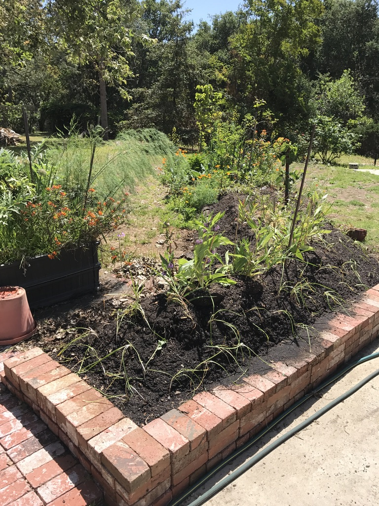

# Permaculture Farming and Gardening

## Permaculture is...

"Permaculture is a Revolution Disguised as Organic Gardening". Those of us involved with
Permaculture are trying to leave the land, its plants and its animals in better health
than when we arrived. Some call it Permaculture. Some call it Biodynamic Farming. Or
just Organic Gardening. It is caring for our land and our water with a longer term perspective. 
One of the Permaculture Design goals is to plan for a 200 year horizon. 

For a brief Permaculture overview, the Wikipedia article on Permaculture is a
good place to start: [Permaculture on Wikipedia](https://en.wikipedia.org/wiki/Permaculture)

## Farms and nurseries in Ventura County California

Yin Yang Ranch is one of many permaculture and native plant sites in Ventura
County, California. We are lucky to have an abundance of local resources for 
learning more about improving our soil, wildlife habitat, biodiversity and 
organic farming techniques. Here are a few:

- Apricot Lane Farms -- Their "The Biggest Little Farm" movie is one of the most
  beautiful introductions to biodynamic farming anywhere. [website](https://www.apricotlanefarms.com).
- Quail Springs Permaculture -- Teaching permaculture on a farm in the high
  desert area of Ventura County. [website](https://www.quailsprings.org). 
- Matilija Native Plants Nursery -- specializes in plants that are native to 
  Ventura County and Southern California. They propogate from seeds and cuttings. 
  [website](https://www.matilijanursery.com/about/).
- McGrath Family Farms -- a local organic teaching farm that also sells their 
  locally grown organic produce. [website](https://www.storeatmcgrath.com/about). 
- Plant Good Seed company: a local organic seed company creating locally developed seed
  varieties. [Website](https://www.plantgoodseed.com/)

## Further Permaculture Resources

For many of us, Toby Hemenway’s book Gaia’s Garden (Gaia's Garden: A Guide to Home-Scale Permaculture, 2nd Edition, 2009) is the best all-around reference. Here is a fun quote:

> Remember how self-reliant a natural landscape is. An ecosystem provides for itself. No one brings in truckloads of fertilizer to a forest; no one carries its waste to the dump. The forest takes care of all that internally, producing fertility and recycling litter and debris. In other words, the forest’s inputs and outputs are balanced, leaving little waste, and the work is powered by sunlight. This is the model we strive to emulate.

Some other resources (you can find these are books at your library or
order online): 

1. *Gaia’s Garden: A Guide to Home-Scale Permaculture* by Toby Hemenway, 2009; also Toby’s new book The Permaculture City; and his [website](https://tobyhemenway.com/) 
2. *Teaming with Microbes: The Organic Gardener's Guide to the Soil Food Web*, Revised Edition, by Wayne Lewis, Jeff Lowenfels, with forward by Elaine Ingham, 2010
3. *Food Not Lawns, How to Turn Your Yard into a Garden and Your Neighborhood into a Community*, by Heather Jo Flores; 2006 book; available online for free by email 
at this [website](https://www.foodnotlawns.com/book.html) 
4. *Sepp Holzer's Permaculture: A Practical Guide to Small-Scale, Integrative Farming and Gardening* by Sepp Holzer, 2011 and his [website](https://krameterhof.at/en/)
5. Permaculture Research Institute, a collection of forums, videos, Permaculture Design Courses (PDC’s, as they are known). [Website](https://permaculturenews.org/)
6. *Permaculture: A Designers' Manual*, by Bill Mollison, 1988: One of the first books that articulated the terminology and principles of permaculture
7. *The One-Straw Revolution: An Introduction to Natural Farming* by Masanobu Fukuoka, 1978, some call it “Zen and the Art of Farming”, another of the first major permaculture books
8. *Mycelium Running: How Mushrooms Can Help Save the World* by Paul Stamets, about fungi and their ability to capture carbon, detoxify poisons and enhance medicine and even save the bees. His [website](https://www.fungi.com/)

Help us add to this list! If you have a favorite website, book, permaculture 
farm or other resource you think we should add to this list, let us know by
opening a discussion [here.](https://github.com/jeffbass/com-yin-yang-ranch/discussions)

## Yin Yang Ranch Info

### Yin Yang Ranch Software

A brief overview is [here.](../yyr-Software/index.md) All the software we are developing is open source and described in this project on GitHub:
[Yin Yang Ranch project overview.](https://github.com/jeffbass/yin-yang-ranch)

There are also some pages there that describe our use of Raspberry Pi computers,
cameras, housings and the electronics we have built to support them.

### Photos of Yin Yang Ranch

[Photos of Yin Yang Ranch](https://www.flickr.com/people/195006677@N08/) (link goes to Yin Yang Ranch photos on Flickr)

### Our Coyote and Critter Videos

[Yin Yang Ranch YouTube channel](https://youtube.com/@yinyangranch-h1p?si=e-VBOir_jqmnMndN) (link goes to YouTube)