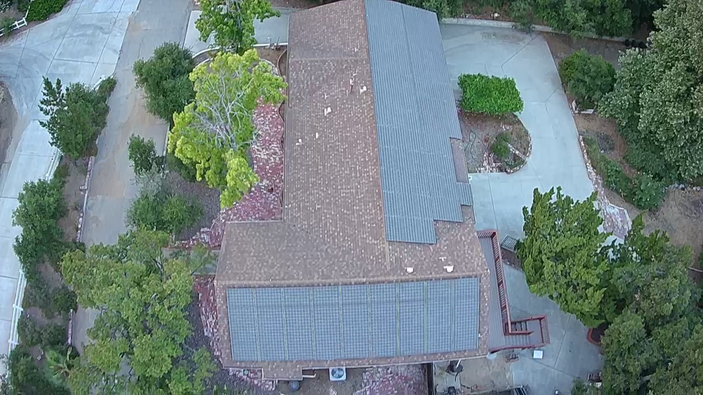

# Solar Power runs Yin Yang Ranch

## Yin Yang Ranch is in Southern California
We get lots of sunny days. About 285 sunny days per year. Our house
is a long ranch house with lots of roof facing East and South. We put 20kW of
solar panels on our roof about 20 years ago. We produce 2-3 times as much electricity as we 
use. 

## Our Driving is Solar Powered

We have had electric cars for 15 years and, even after charging the cars for all
our driving, we produce more electricity than we use. We "sell" this power back
to the our local power company Southern California Edison. Under our solar 
net metering contract, we get paid for our net generation. Unfortunately, our
current contract expires in a couple of years and then we will no longer be paid for 
our excess generated power. 

## Measurement and Tracking

We measure our solar output and correleate it with weather and time of year. 
It helps with knowing how much light our plants are getting and helps
optimize watering times and amounts.

The above graph is from our power company bill. It shows our Daily Average Electricity usage (kWh).
All the numbers are negative because we produce more electricity than we use. 
Every month of the year. In July, 2024 we produced an average excess of 69 kWh per day.
Or 2,139 more kWh than we used. That's enough to power 2 homes in our area. 
Over and above what we use ourselves.
