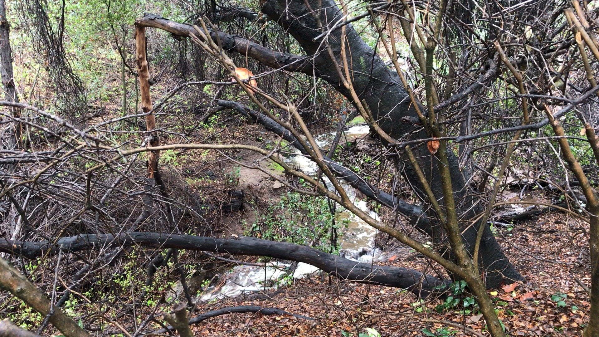

# Water is Precious -- and Drought is common here

Yin Yang Ranch is in a valley in Ventura County in Southern California. The city
we are in gets 100% of its tap water from the MWD of Southern California. Most
cities within the MWD get their water from a mix of sources including limited 
groundwater, some seasonal streams and aqueducts from the Colorado River or
various reservoirs in Northern California. Our city's tap water comes 
from Northern California. 

## Water pipe 440 miles long?

Here is a cartoon map of California showing the 440 mile journey our water 
takes to get from it's source in the High Sierra Mountains to us. (this map is
from the Las Virgenes Water District
[webpage](https://www.lvmwd.com/community-resources/the-journey-your-water-takes))

The tap water supply for Yin Yang Ranch comes 100% from Lake Oroville and the
Feather River that feeds it. The water travels over 440 miles through a complex
series aqueducts, pumps and pipelines before it reaches our local water
treatment facility. Passing through so many miles of concrete aqueducts changes 
the chemistry of the water. The rainwater in the Feather River area is slighly 
acidic and has few mineral salts. But by the time the water reaches Ventura
County, it is quite alkaline and contains a variety of calcium and other salts. 

## Our Creek Flows in Winter

Of course, it does rain in Southern California (contrary to that well known
rock song). Our typical rainfall in our
valley is about 15 inches a year. But there is a **lot** of variation year to year.
Droughts have become more common in the last 30 years. We had a year of only 4 
inches of rain in 2020. But in 2023, we had 22 inches. In 2004 we had 30 inches.

## Capturing Rainwater

We do capture rainwater from our roof into barrels and use it mainly to make
compost, since compost bacteria are killed by the chlorine in tap water. We use
the rainwater for watering our native plants and fruit trees as long as it lasts
each year. Then we use our chlorinated, alkaline and mineral-salts tap water
to keep our plants alive through the dry season. 

