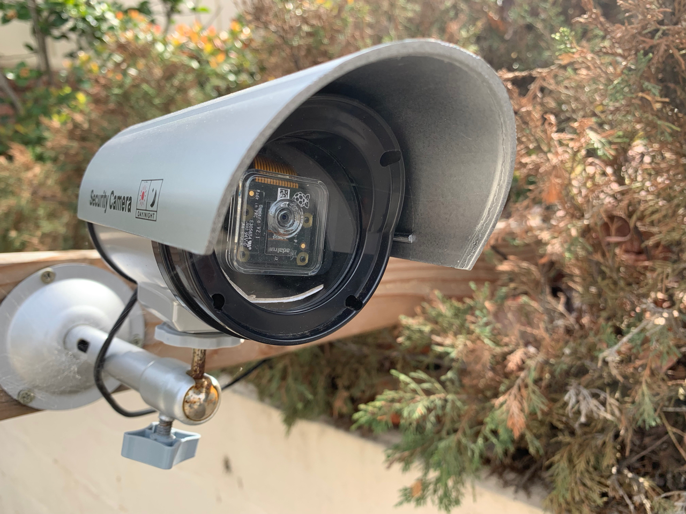
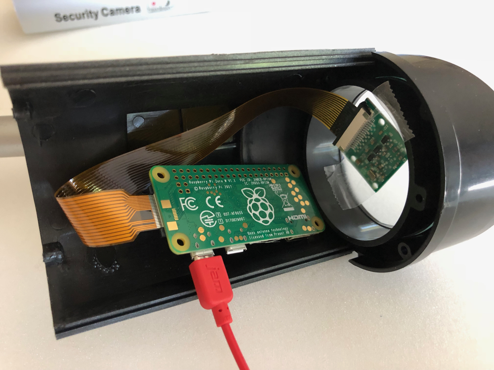

# Software R & D

Yin Yang Ranch is evolving. New housing developments around us are changing the
way the local wildlife lives and travels about. As see this happening, we want
to observe and document it.

We are developing a network of cameras, sensors and software to track the local 
environment and its wildlife. Some of the cameras are commercial ones like
Google Nest cameras that have infrared capability. Some of the cameras are 
self-built projects we put together using small computers and camera sensors.

## PyCon 2020 Talk

Jeff Bass, owner of Yin Yang Ranch, gave a talk about his open source software
and its use in and around Yin Yang Ranch project at the U.S. Python Conference
PyCon 2020:

**Jeff Bass - Yin Yang Ranch: Building a Distributed Computer
Vision Pipeline using Python, OpenCV and ZMQ**

- [PyCon 2020 Video Talk about the project](https://youtu.be/76GGZGneJZ4?t=2)
- [The PyCon 2020 Talk Presentation slides](https://speakerdeck.com/jeffbass/yin-yang-ranch-building-a-distributed-computer-vision-pipeline-using-python-opencv-and-zmq-17024000-4389-4bae-9e4d-16302d20a5b6)

All the software we are developing is open source and described in this project 
on Gihub: [Yin Yang Ranch project overview](https://github.com/jeffbass/yin-yang-ranch)

There are also some pages there that describe our use of Raspberry Pi computers,
cameras and the housings and electronics we have built to support them.

## Cameras and Sensors

We use cameras to track our urban wildlife. We use a mix of cameras. Some are
commercial cameras like Google Nest Cameras. Others are camera sensors we 
connect to small Raspberry Pi computers. We use a variety of enclosures for
our handbuilt cameras including some $5 Fake Security Cameras; we take them
apart and put a Raspberry Pi computer with a PiCamera module into it.

### Driveway Camera

We have a camera that watches our driveway. Has the mail come today? Have any
Coyotes passed by?

Fake Security Camera For $5 on Amazon:

It holds a Raspberry Pi Computer and a PiCamera Module. And becomes a wildlife
camera: 

Here's what it looks like when we've taken the housing apart and put a
Raspberry Pi computer and its PiCamera module into it:

### Barn IR Camera & Temperature Sensor

We have a bare infrared PiNoir camera sensor on the back of the barn. It can't
be behind glass because that blocks infrared light. So we put a few shingles 
over the infrared camera sensor to shade it from the rain. We added 
a temperature sensor and an infrared spotlight. The sensor and camera cables 
pass through holes in the barn wall to the Raspberry Pi computer inside the barn.

Here is a closeup photo of the PiNoir Camera module and the temperature sensor 
under their protective shingles:

Here's a view of them that shows the Infrared Flooglight. You can see the red 
light of the camera module under the shingles with the temperature sensor probe 
just to the left of it: 

And here is an image this setup captured of a coyote behind the barn:

We have about a dozen cameras distributed around Yin Yang Ranch. We are writing
software to manage the stream of images and perform image analysis to identify 
coyotes vs. bobcats. And we are working on computer vision software to
distinguish invidivual animals based on their markings and their gait as they walk.  
