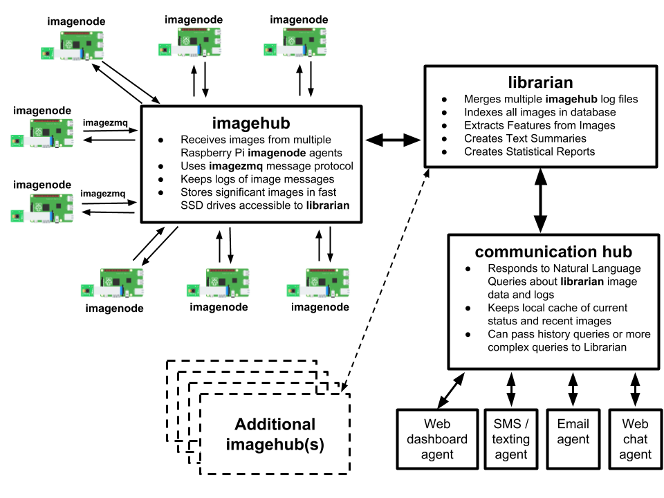

# Software R & D

Yin Yang Ranch is evolving. New housing developments around us are changing the
way the local wildlife lives and travels about. As see this happening, we want
to observe and document it.

We are developing a network of cameras, sensors and software to track the local 
environment and its wildlife. Some of the cameras are commercial ones like
Google Nest cameras that have infrared capability. Some of the cameras are 
self-built projects we put together using small **Raspberry Pi** computers and
camera sensors.

## PyCon 2020 Talk

All our Yin Yang Ranch software is written in a computer language called
**Python**. Jeff Bass, lead software geek of Yin Yang Ranch, gave a talk about his open source software
and its use in and around Yin Yang Ranch at the U.S. Python Software Conference
PyCon 2020:

**Jeff Bass - Yin Yang Ranch: Building a Distributed Computer
Vision Pipeline using Python, OpenCV and ZMQ**

- [PyCon 2020 Video Talk about the project](https://youtu.be/76GGZGneJZ4?t=2)
- [The PyCon 2020 Talk Presentation slides](https://speakerdeck.com/jeffbass/yin-yang-ranch-building-a-distributed-computer-vision-pipeline-using-python-opencv-and-zmq-17024000-4389-4bae-9e4d-16302d20a5b6)

## Yin Yang Ranch Software

All the software and electronics we are developing is open source and described in this project 
on GitHub: [Yin Yang Ranch project overview](https://github.com/jeffbass/yin-yang-ranch).
There are links in that project repository to the source code of all our software
packages, including `imageZMQ`, `imagenode` and `imagehub`. There is a working 
prototype of the `librarian` package in the [overview repository.](https://github.com/jeffbass/yin-yang-ranch) 

The design of the software system is what is called a Distributed Computer Vision
Pipeline. The pipeline starts with 8-12 Raspberry Pi computer servers with attached 
cameras at various places around the farm: watching the driveway, on the back of 
the barn aimed at the creek, aimed at the grape arbor, watching the water meter
etc. These Raspberry Pi `imagenodes` capture images and select which images
meet "send them" criteria, which varies by the location and job of the specific 
Raspberry Pi computer. These images are transmitted via our `imageZMQ` program
to the `imagehub` server in the house. Finally, a `librarian` program sorts
through the images and labels them and answers questions about them. Here is 
a text message dialog with the `librarian` software bot (named "Susan"): 

This is a design diagram of the overall Computer Vision Distributed Pipeline:

## Raspberry Pi Computers

For those unfamiliar with them, Raspberry Pi computers are about the size of a 
credit card and use less power than a flashlight. Each one runs a full server version 
of Linux, the same operating system that runs most of the servers on the internet. 

We use Raspberry Pi computers to operate cameras and sensors in multiple 
locations around Yin Yang Ranch. They are small enough that they can fit into
light fixtures, security camera housings or a pint-sized glass mason jar.

Here is a Raspberry Pi computer and its Raspberry Pi Camera Module:

Here is a glass Mason jar holding a Raspberry Pi computer and Camera Module.
It is positioned on our water meter cover watching the dial of the 
water meter. We can ask Susan, the Librarian Bot, if the water is running 
and get an answer in real time (see the text messages photo above):

## Cameras and Sensors

We use cameras to track our urban wildlife. We use a variety cameras. Some are
commercial cameras like Google Nest Cameras. Others are camera sensors we 
connect to small Raspberry Pi computers. We use a variety of enclosures for
our hand-built cameras including some $5 Fake Security Cameras; we take them
apart and put a Raspberry Pi computer with a PiCamera module into it.

### Driveway Camera

We have a camera that watches our driveway. Has the mail come today? Have any
Coyotes passed by?

Fake Security Camera For $5 on Amazon:

It holds a Raspberry Pi Computer and a PiCamera Module. And becomes a wildlife
camera: 

Here's what it looks like when we've taken the housing apart and put a
Raspberry Pi computer and its PiCamera module into it:

### Barn IR Camera & Temperature Sensor

We have a bare infrared PiNoir camera sensor on the back of the barn. It can't
be behind glass because that blocks infrared light. So we put a few shingles 
over the infrared camera sensor to shade it from the rain. We added 
a temperature sensor and an infrared spotlight. The sensor and camera cables 
pass through holes in the barn wall to the Raspberry Pi computer inside the barn.

Here is a closeup photo of the PiNoir Camera module and the temperature sensor 
under their protective shingles:

Here's a view of them that shows the Infrared Flooglight. You can see the red 
light of the camera module under the shingles with the temperature sensor probe 
just to the left of it: 

And here is an image this setup captured of a coyote behind the barn:

We have about a dozen cameras distributed around Yin Yang Ranch. We are writing
software to manage the stream of images and perform image analysis to identify 
coyotes vs. bobcats. And we are working on computer vision software to
distinguish individual animals based on their markings and their gait as they walk.  
